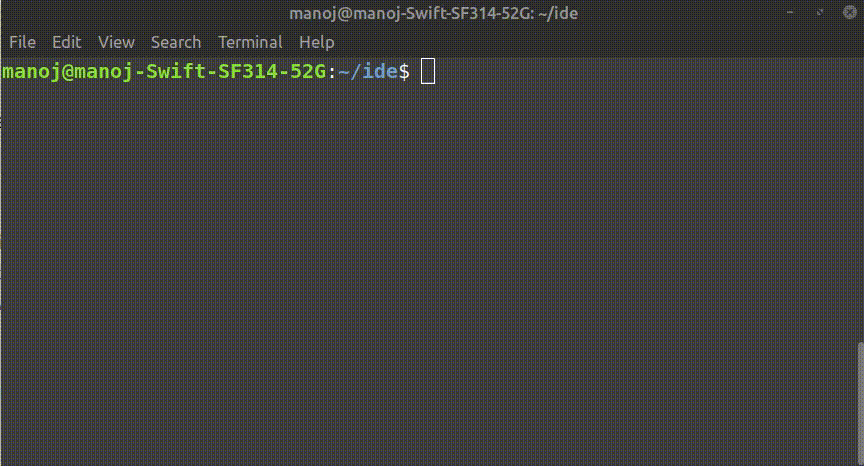

<h1 align="center">
  CODECHECK 
 </h1>
 <br>
<p align="center">A CLI to get your own AI coding assistant on the terminal.</p>
<br>

<p align="center">
  
</p>


---

## Usage

Run command 'codecheck' in the active directory. This will list all the files as options. Then you can select any file you want for AI assitance

```
~$ codecheck
```


> :warning: **Please be aware that the file content will be accessed by a thrid party api.(Google PaLM-api)**

<br>

## Installation


#### Add google palm api key
1. Generate free google palm api key from Google AI studio.
2. Add api key to .env.example and change file name to .env


#### Build and install
1. Clone the repository and then navigate to it.
2. Run ```npm install``` to install the dependencies.
3. Run ```npm build``` to start build process.
4. Run ```npm install -g .``` to install the CLI globally in your pc. <br>


> :warning: **This might cause an error** which can be resolved easily by using ```sudo``` with the command, **however**, using ```sudo``` with ```npm``` is **not recommended** because it might cause permission issues later. So instead put the code below in your .bashrc file and then run the above command again.
```
npm set prefix ~/.npm
PATH="$HOME/.npm/bin:$PATH"
PATH="./node_modules/.bin:$PATH"
```
5. Now you are good to go and can use the CLI globally!

### Type ```codecheck``` in the cli to get started.

<br>


## Summary

- Learnt so many new things with this task, so overall a very fruitful experiene.
- The sample cli app given in the task was very useful as a starting guide for someone new to cli apps like me.
- Kicking myself for letting me wander deep into many new topics I came across while building this app, could have easily finished it very soon.
- Will be building more cli apps in the future.
